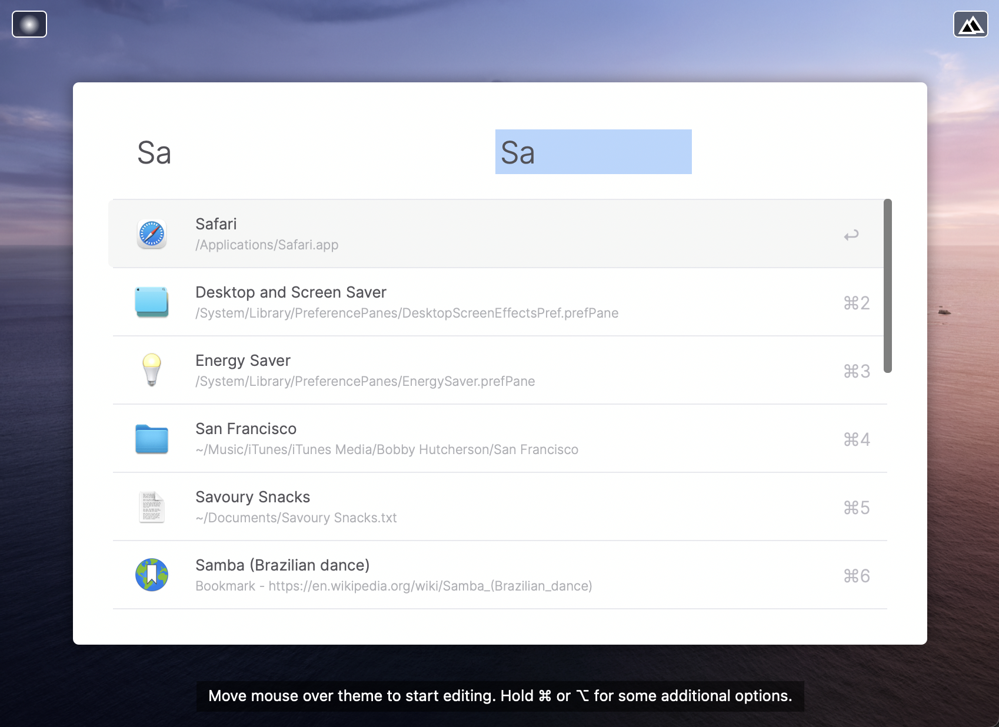
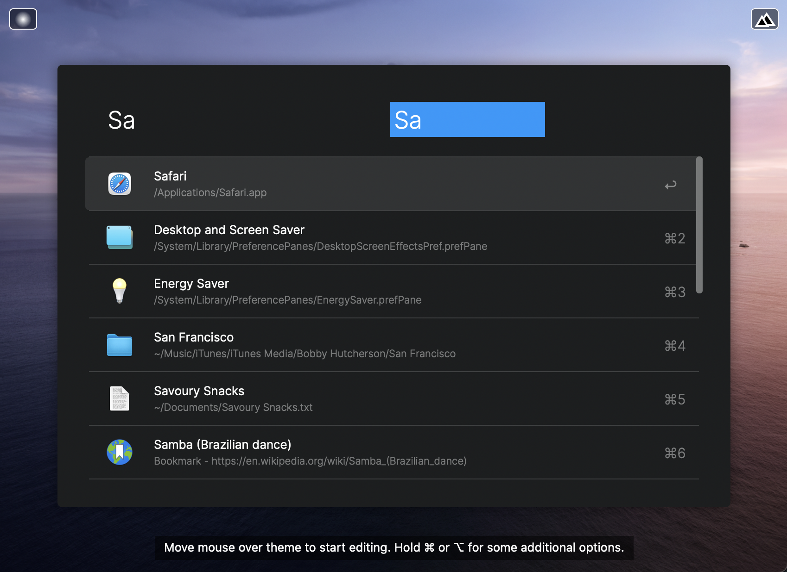
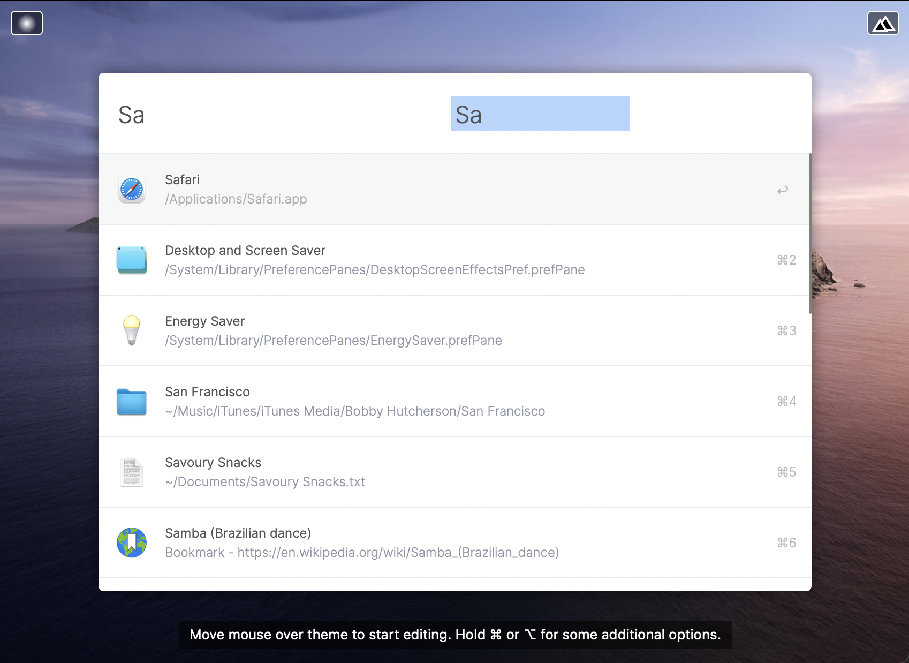
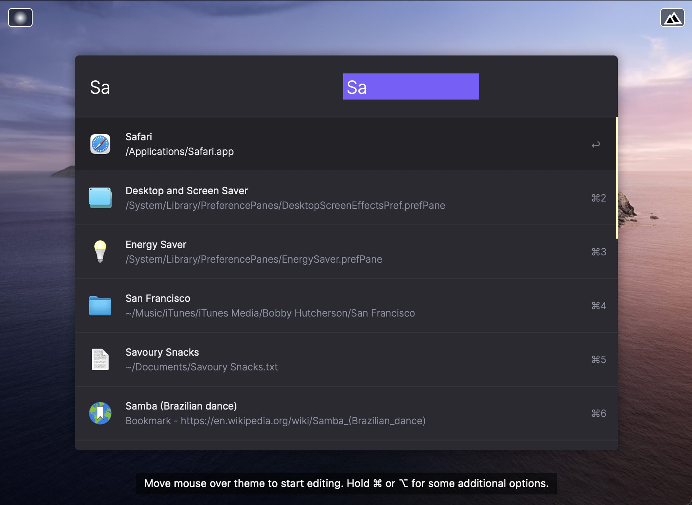

# Tempo Powerpack Theme

Here is an [Alfred Powerpack Theme](https://www.alfredapp.com/help/appearance/) that is inspired by the [Tempo](https://www.yourtempo.co/) email client's appearance and color scheme.

<a href="https://github.com/chrismessina/alfred-theme-tempo/raw/main/alfred-theme-tempo.zip" class="button">
  <bigger>Download Themes</bigger>
</a>

## Installation

These themes use [Rasmus Andersson's](https://rsms.me/) open source [Inter](https://rsms.me/inter/) typeface, which is available on [GitHub](https://github.com/rsms/inter). Download and install that first.

Download the zip file above, unzip it, and then double-click each `.alfredappearance` file to install it.

## Previews

### Tempo (Light)

### Tempo (Dark)

### Tempo Alternative (Light)

### Tempo Alternative (Dark)

## Suggested configuration

- Disable the Alfred hat logo by unchecking: `Alfred Preferences › Appearance › Options › Hide hat on Alfred window`
- Disable result shortcuts by unchecking: : `Alfred Preferences › Appearance › Options › Hide result shortcuts`

Simplify results by switching the result subtext to "Only for Alternative Actions".

## About

This theme is unaffiliated with nor endorsed by Tempo.

<a href="https://www.alfredforum.com/topic/16261-tempo-inspired-theme/">Alfred Forum link</a>.
